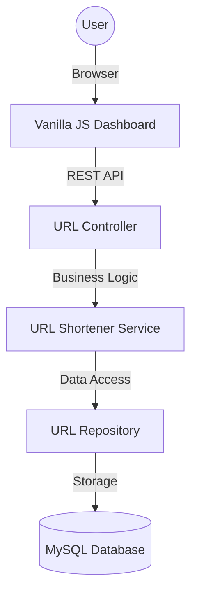

# 🔗 ShortLink - Production-Grade URL Shortener


ShortLink is a high-performance, robust URL shortening service built with a modern tech stack. It features a sleek glassmorphism-inspired dashboard, real-time analytics tracking, and a scalable backend architecture.

---

## ✨ Key Features

- **🚀 Instant Shortening**: Generate unique 6-character short codes for any URL.
- **📊 Real-time Analytics**: Track click counts and creation dates for every link.
- **🎨 Modern UI**: Stunning dashboard with glassmorphism design and responsive layout.
- **🛡️ Secure & Robust**: Built with Spring Boot for enterprise-grade reliability.
- **🛠️ Easy Setup**: Fully automated PowerShell script for dependency management and startup.

---

## 🏗️ Architecture



---

## 🛠️ Tech Stack

- **Backend**: Java 1.8, Spring Boot 2.7.x, Spring Data JPA, Hibernate.
- **Frontend**: HTML5, Modern CSS (Glassmorphism), Vanilla JavaScript, Lucide Icons.
- **Database**: MySQL 8.0+.
- **Build Tool**: Maven 3.9+.

---

## 📂 Project Structure

```text
voting_project/
├── src/main/java/com/shortlink/
│   ├── controller/      # REST Endpoints
│   ├── service/         # Business Logic & Code Generation
│   ├── repository/      # Data Access Layer
│   └── entity/          # Database Models
├── src/main/resources/
│   ├── static/          # Frontend (HTML, CSS, JS)
│   └── application.properties # Configurations
├── .gitignore           # Standard Java/Maven ignores
├── pom.xml              # Maven Dependencies
└── setup_run.ps1        # Automated Startup Script
```

---

## 🚀 Quick Start

### Prerequisites
- **Java 8** or higher installed.
- **MySQL** server running.

### 1. Database Setup
The application will automatically create the `url_shortener` database if it doesn't exist.
Update your MySQL credentials in `src/main/resources/application.properties`:
```properties
spring.datasource.username=YOUR_USERNAME
spring.datasource.password=YOUR_PASSWORD
```

### 2. Run the Application
**Option A: Automated (Recommended)**
Open PowerShell in the project root and run:
```powershell
.\setup_run.ps1
```
*This script will automatically download Maven and start the server.*

**Option B: Manual**
If you have Maven installed:
```bash
mvn spring-boot:run
```

### 3. Access the Dashboard
Once the server starts, navigate to:
👉 **[http://localhost:8080](http://localhost:8080)**

---

## 📡 API Documentation

| Method | Endpoint | Description |
| :--- | :--- | :--- |
| `POST` | `/api/v1/urls/shorten` | Shorten a new URL |
| `GET` | `/api/v1/urls/stats` | Retrieve all link analytics |
| `DELETE` | `/api/v1/urls/{id}` | Remove a link mapping |
| `GET` | `/{shortCode}` | Redirect to original URL |

---

## 🤝 Contributing
Contributions are welcome! Please feel free to submit a Pull Request.

## 📄 License
This project is licensed under the MIT License - see the [LICENSE](LICENSE) file for details.

---
*Created with ❤️ by SRI VIGNESHWARAN B*
